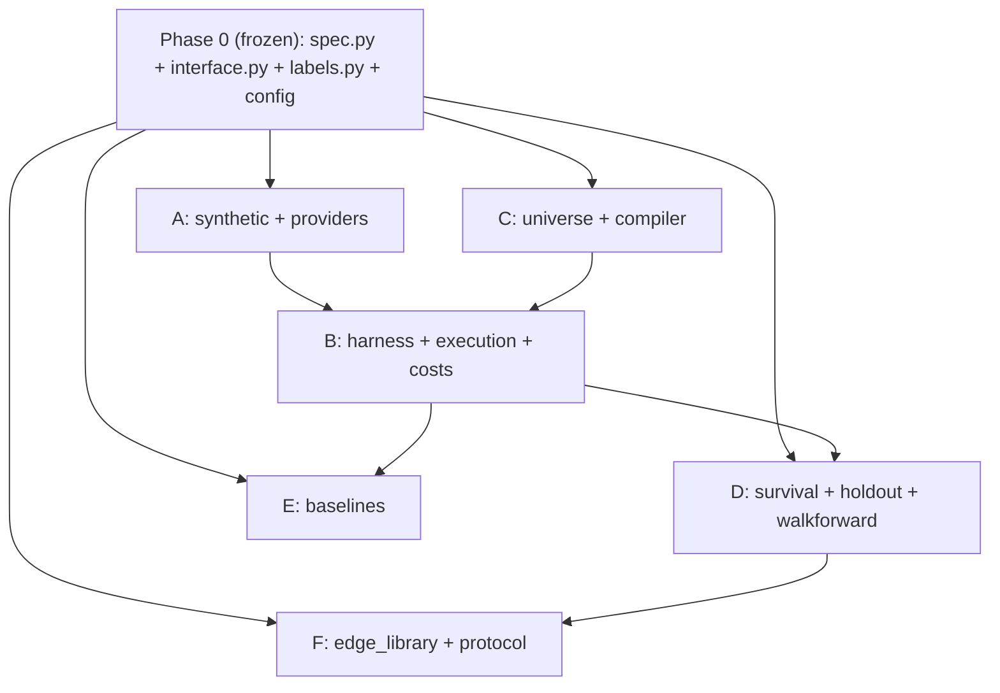

# Parallel Build Plan

This document describes how the system specified in `README.md` is decomposed so
that multiple agents can build it concurrently. `README.md` is the master spec and
the source of truth; this file is the execution plan layered on top of it. If the
two ever disagree, `README.md` wins.

## The core move: freeze the seams, then fan out

Almost every component either produces or consumes one of three shared contracts.
Nothing can be parallelized safely until those contracts are frozen. So the build
is a short serial **Phase 0**, followed by a wide **Phase 1**.

The three frozen seams:

1. `src/hypothesis/spec.py` — `HypothesisSpec`, the generator -> judge interface.
2. `src/data/interface.py` — `DataProvider`, the real-data -> harness interface.
3. `src/backtest/labels.py` — `SignalResult` / `BacktestResult`, the harness ->
   (baselines, validation, library) interface.

The compiler/harness handoff is also fixed: `compile_spec()` is the only supported
constructor of a typed `CompiledHypothesis` dictionary, and `BacktestHarness.run()`
accepts that compiled object rather than a raw `HypothesisSpec`. Baselines consume
the same compiled object, the candidate result, and an explicit evaluation range.

After Phase 0 these files are treated as frozen APIs. Any change is an RFC that
pauses every dependent stream.

## Phase 0 — Foundation (DONE in the working tree, single-threaded)

This phase is complete in the working tree. It becomes the immutable baseline when
the repository is initialized and the first commit is created; until then, do not
run concurrent writers against this folder.

- [x] Repo scaffold, `pyproject.toml`, `config/*.yaml`.
- [x] `HypothesisSpec` dataclass + validator + `tests/test_spec_validator.py`.
- [x] Abstract `DataProvider` seam (`src/data/interface.py`).
- [x] Frozen backtest result / label schema (`src/backtest/labels.py`).
- [x] Phase 1 files scaffolded as stubs, each marked with its owning stream.

The two worked examples from `README.md` (`weekend_reversal_v1`, `pead_long_v1`)
are committed as JSON fixtures in `tests/fixtures/` and are validated by the test
suite, so Phase 1 agents have known-good specs to build against.

## Phase 1 — Parallel workstreams

Each stream owns one directory, so file-level merge conflicts are rare. The only
shared touchpoints are the three frozen seams above.

### Agent A — Data layer (`src/data/`)
- `synthetic.py`: random-walk panels with a deliberately injected effect
  (Friday->Monday drift, post-surprise drift). High priority: Agent B needs it.
- `wrds_provider.py`, `edgar.py`: implement behind `DataProvider` when data arrives.
- Acceptance: implements every abstract method of `DataProvider`; synthetic panel
  has a documented, recoverable injected effect.

### Agent B — Backtest harness (`src/backtest/`) — critical path
- `harness.py`, `execution.py`, `costs.py` (compute logic only — `labels.py` schema
  is frozen).
- Tests: `test_harness_no_lookahead.py`, `test_harness_recovers_injected_effect.py`,
  `test_costs.py`.
- Acceptance: recovers Agent A's injected effect with correct sign and magnitude;
  signal formation cannot read beyond its information cutoff. Outcome labeling may
  read later prices only after the signal and fill have been frozen.

### Agent C — Universe + Compiler (`src/universe/`, `src/hypothesis/compiler.py`)
- `constructor.py`: point-in-time `universe(date) -> set[ticker]`.
- `compiler.py`: `HypothesisSpec -> backtest config`, with lookahead validation.
- `generator.py` (LLM) stays a stub — deferred until the harness reproduces anomalies.

### Agent D — Validation / survival filter (`src/validation/`) — the product
- `survival.py` (deflated Sharpe, FDR), `holdout.py`, `walkforward.py`.
- Build against synthetic `BacktestResult` records; integrate with Agent B later.

### Agent E — Baselines (`src/baselines/baselines.py`)
- Benchmark, simple momentum, simple PEAD, random-in-bucket.
- Consumes the `SignalResult` schema; integrate with Agent B's output later.

### Agent F — Edge library + protocol (`src/library/`, `protocol/`)
- `edge_library.py`: store surviving specs with stats, costs, capacity, regimes.
- `protocol/validation_protocol.md`: pre-registered, fully independent, start now.

## Dependency graph

## Critical path

`Phase 0 -> synthetic.py (A) -> harness (B) -> survival filter (D)`

Everything else hangs off the side and is genuinely parallel. With only two agents,
put both on this spine.

## Integration rules

- The three seam files are frozen. Changing one is an RFC that pauses dependents.
- One agent per directory. Cross-directory edits go through the seams only.
- `costs.py` exposes a stable function signature consumed by `execution.py`.
- Every stream lands with its own tests green before integration.

## Explicitly deferred (do not parallelize yet)

Per `README.md` scope discipline and the "build the judge first" principle:

- `generator.py` (LLM) — until the harness reproduces known anomalies.
- Real `wrds_provider.py` / `edgar.py` data logic — when data arrives.
- Tier 2 text features, shorts, portfolio construction, any product wrapper.
